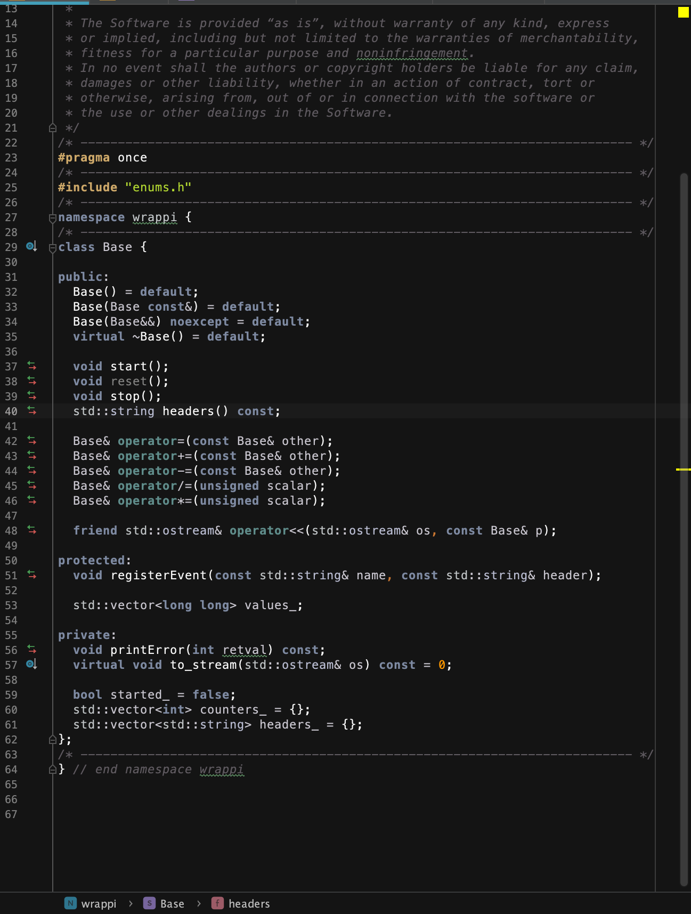
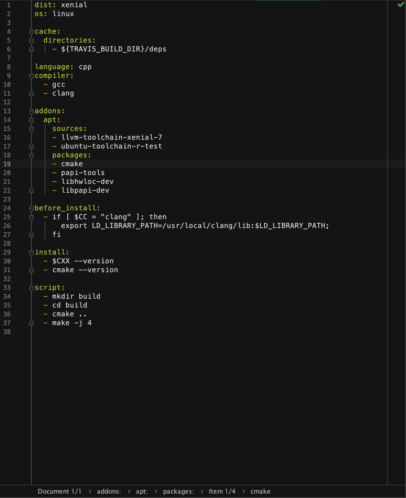
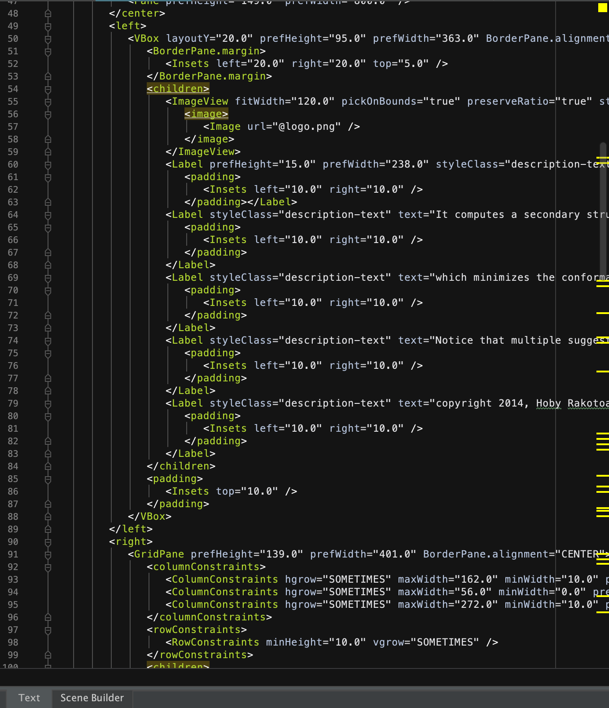
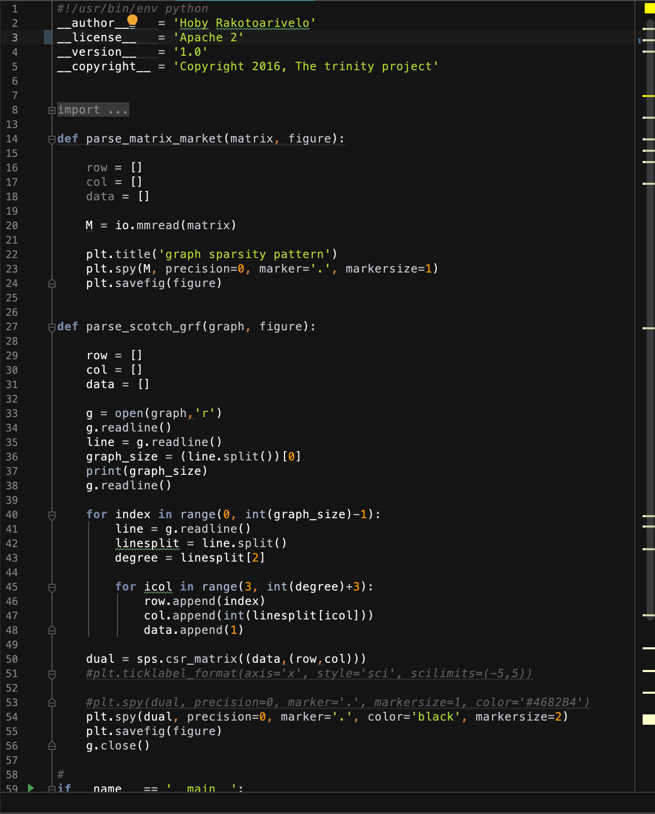

### mustang-theme

A clean color scheme for JetBrains [CLion](https://www.jetbrains.com/clion/) and [IDEA](https://www.jetbrains.com/idea/).  
It is adapted from the excellent [Vim theme](https://www.deviantart.com/hcalves/art/Mustang-Vim-Colorscheme-98974484) designed by Henrique Alves (also included).  
Syntax coloring has been adapted for almost all supported languages by both IDE.

###### Importing the theme

- Just go to Preferences > Editor > Color scheme > Import scheme.

- Or run the provided [`install.sh`](install.sh) script and restart the IDE.

###### Screenshots

Some preview of supported languages:

<table>
  <tr>
    <td>c++</td><td>java</td><td>cmake</td>
  </tr>    
  <tr>
    <td></td>
    <td></td>  
        <td></td>
  </tr>
  <tr>
    <td>yaml</td><td>xml</td><td>python</td>
  </tr>    
  <tr>
    <td></td>
    <td></td>
    <td></td>
  </tr>

</table>

Enjoy! 😊
